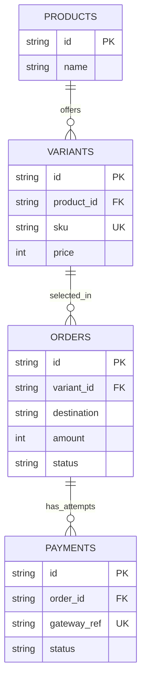

# Data dan integrasi PPOB

Contoh konseptual, bukan schema executable untuk disalin tanpa penyesuaian.

Tambahkan ownership, expiry, currency, audit fields, dan entitas sesuai scope. Simpan snapshot harga pada order; jangan percaya harga client. Integer contoh mengasumsikan IDR.

Putuskan aturan:
- Akses pesanan: invoice yang dapat ditebak bukan autentikasi.
- Transisi pembayaran/order, pembayaran terlambat, kegagalan pemenuhan.
- Signature webhook, nominal, currency, dan identitas order sesuai provider.
- Unique gateway reference saja tidak menjamin idempotency: transaksi/transisi bersyarat harus mencegah pemenuhan ganda.
- Retry create transaksi membutuhkan dukungan idempotency/rekonsiliasi; jangan retry buta.
- Worker, polling, timeout, refund mengikuti kebutuhan/kontrak aktual.

Tidak ada janji performa tanpa pengukuran. Buat schema/migration lengkap untuk proyek aktual; contoh bukan implementasi Prisma.
