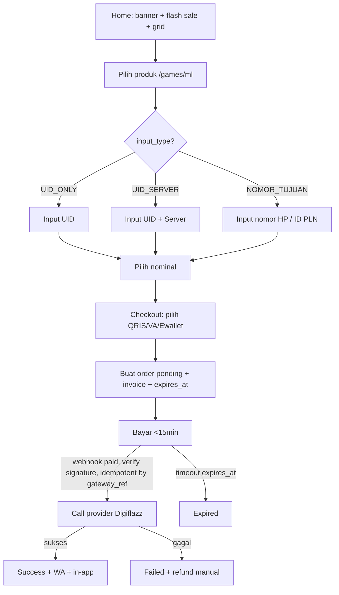

# Contoh Output Phase 4 - DB + Flowchart + Arsitektur PPOB (tinggal paste)

Source of truth for DB schema. Phase 4 and Phase 5 both read this file; keep schema here, never inline elsewhere.

## 1. DBML - paste ke https://dbdiagram.io/d
```dbml
Table users {
  id uuid [pk]
  name varchar
  phone varchar [unique]
  email varchar [unique]
  password_hash varchar
  created_at timestamp
  updated_at timestamp
}

Table categories {
  id integer [pk]
  name varchar // Mobile Game, Voucher, PC Game, Pulsa & PPOB
  slug varchar [unique]
  sort integer
}

Table products {
  id integer [pk]
  category_id integer [ref: > categories.id]
  name varchar // Mobile Legends, Free Fire UID
  slug varchar [unique]
  image_url varchar
  input_type varchar // UID_ONLY, UID_SERVER, LOGIN_DROP_LINK, NOMOR_TUJUAN
  is_active boolean
}

Table variants {
  id integer [pk]
  product_id integer [ref: > products.id]
  label varchar // 86 Diamond
  sku varchar [unique] // ML-86
  provider_code varchar // digiflazz sku
  cost integer // modal
  price integer // jual normal
  price_qris integer // harga terbaik QRIS
  is_active boolean
}

Table banners {
  id integer [pk]
  image_url varchar
  link_url varchar
  sort integer
  active boolean
}

Table flash_sales {
  id integer [pk]
  variant_id integer [ref: > variants.id]
  promo_price integer
  stock_promo integer
  starts_at timestamp
  ends_at timestamp
}

Table orders {
  id uuid [pk]
  invoice varchar [unique] // INV-20260908-XXXX
  user_id uuid [ref: > users.id] // nullable for guest
  product_id integer [ref: > products.id]
  variant_id integer [ref: > variants.id]
  game_uid varchar
  game_server varchar
  phone_target varchar // untuk pulsa/PLN
  amount integer
  status varchar // pending, paid, processing, success, failed, expired
  expires_at timestamp // pending order auto-expire 15min
  created_at timestamp
  updated_at timestamp
  indexes {
    (invoice) [unique]
  }
}

Table payments {
  id uuid [pk]
  order_id uuid [ref: > orders.id]
  method varchar // QRIS, VA_BCA, OVO, ALFAMART
  gateway_ref varchar [unique] // idempotency webhook
  qris_payload text
  paid_amount integer
  paid_at timestamp
  raw_webhook json
  indexes {
    (gateway_ref) [unique]
  }
}

Table articles {
  id integer [pk]
  slug varchar [unique]
  title varchar
  body text
}

// v2 (jangan buat di v1):
// Table wallets { id uuid [pk] user_id uuid balance integer }
// Table vouchers { id integer [pk] code varchar discount integer }
```

## 2. Prisma - `prisma/schema.prisma` (mirror DBML 1:1)
```prisma
datasource db { provider = "postgresql" url = env("DATABASE_URL") }
generator client { provider = "prisma-client-js" }
model Category { id Int @id @default(autoincrement()) name String slug String @unique sort Int @default(0) products Product[] }
model Product { id Int @id @default(autoincrement()) categoryId Int category Category @relation(fields:[categoryId], references:[id]) name String slug String @unique imageUrl String? inputType String isActive Boolean @default(true) variants Variant[] }
model Variant { id Int @id @default(autoincrement()) productId Int product Product @relation(fields:[productId], references:[id]) label String sku String @unique providerCode String cost Int price Int priceQris Int isActive Boolean @default(true) }
// Order, Payment, Banner, FlashSale, User, Article follow same field names; money Int; String @default(uuid()) for uuid ids.
// Add to Order: invoice String @unique, user_id nullable FK, expires_at, status enum, @@index([invoice]).
// Add to Payment: gateway_ref String @unique (webhook idempotency).
```

## 3. Mermaid - paste ke https://mermaid.live/


Draw.io: Extensions -> Advanced -> Mermaid, paste di atas. Atau swimlane manual: User / Frontend / /api/orders / Webhook / Provider.

## 4. Arsitektur 1 halaman
- Frontend: Next.js 15 App Router, `/`, `/games/[slug]`, `/payment/[invoice]`, ISR 60s katalog, BottomNav mobile
- Backend: Route Handlers `POST /api/orders` (zod validate, buat invoice + expires_at, hitung harga QRIS), `POST /api/webhook` (verify signature Midtrans/Xendit, update paid, idempotent by gateway_ref, enqueue process)
- Worker: `lib/provider.ts` `createTx({sku,uid,server})` timeout 10s retry 3x, `checkStatus(ref)` polling 30s x10
- DB: Postgres + Prisma, index `orders(invoice)`, `variants(sku)`, `products(slug)`, `payments(gateway_ref)`
- Target: katalog p99 <300ms @200rps, webhook idempotent by `gateway_ref`

## 5. API contract v1
```
POST /api/orders {productSlug, variantSku, gameUid, gameServer?, phoneTarget?, method} -> {invoice, qrisPayload, expiresAt}
GET /api/orders?invoice=INV-xxx -> {status, product, variant, paidAt}
POST /api/webhook {gateway_ref, status, signature} -> 200 OK (verify dulu)
```
